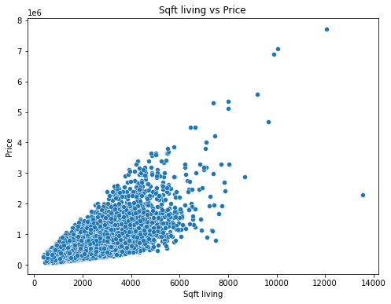

# Exploring the Dynamics of Real Estate Market in King County.

## Group Members.

Bennie Kibet

Victor Muuo

Chemutai Annolyne

Josphat Wanjiru

Eric Rono

Gladys Mosota

## Overview

The King County Housing Data Set provides information about houses in King County, including their size, location, condition, and other features. The objective of this project is to create a multiple regression model that can accurately predict the price of a house.

The project is commissioned by a commercial real estate company interested in purchasing homes within a specific area. Their main concerns revolve around obtaining predicted prices for homes in the area, and assessing any notable disparities between the actual prices and our model's predicted prices.    

## Business Understanding

The client's primary objective is to develop a platform that can offer precise house price estimates which are paramount for both buyers and sellers in King County.

In order to achieve this, we are required to come up with a model that is capable of deducing the main factors that influence the house prices. In order to train the model effectively, the client seeks to utilize accurate and representative data pertaining to the real estate market in King County. This data contains historical sales, current listings, size of the property and other pertinent features.

The model will be able to make precise estimations of a house's value based on its features upon successful training, the model can be seamlessly integrated into the platform, providing buyers and sellers with reliable estimates of house prices. The information drawn from the model will help both buyers and sellers to make well-informed decisions regarding property transactions.

Harnessing the power of technology by delivering a dependable and accurate platform for house buying and selling in King County, the client can establish themselves as a trusted source in the local real estate market which will then in turn attract a dedicated customer base.   

### Problem Statement

Riaor Real Estate faces challenge in effectively entering the dynamic King County real estate market due to the complex interplay of factors influencing housing prices and demand. Understanding the intricate relationship between property features,seasonal trends, and market dynamics is crucial for developing successful market penetration and growth strategies.  

### Objectives:  

1. **Identify key determinants of house prices:**
The goal is to determine which features of a house have the most significant impact on its price in King county.  

2. **Investigating whether large houses tend to have higher prices?**   
The goal is to determine if large houses tend to have high prices in the market.  

3. **Develop a Linear Regression Model to Predict Housing Prices**   
Create a multiple linear regression model using the identified key determinants to predict the house prices. Evaluate the model's performance using appropriate metrics such as R-squared, RMSE, and MAE.  

## Column Names and descriptions for Kings County Data Set
* **id** - unique identified for a house
* **Date** - house was sold
* **Price** -  is prediction target
* **bedroomsNumber** -  of Bedrooms/House
* **bathroomsNumber** -  of bathrooms/bedrooms
* **sqft_livingsquare** -  footage of the home
* **sqft_lotsquare** -  footage of the lot
* **floorsTotal** -  floors (levels) in house
* **waterfront** - House which has a view to a waterfront
* **view** - Has been viewed
* **condition** - How good the condition is ( Overall )
* **grade** - overall grade given to the housing unit, based on King County grading system
* **sqft_above** - square footage of house apart from basement
* **sqft_basement** - square footage of the basement
* **yr_built** - Built Year
* **yr_renovated** - Year when house was renovated
* **zipcode** - zip
* **lat** - Latitude coordinate
* **long** - Longitude coordinate
* **sqft_living15** - The square footage of interior housing living space for the nearest 15 neighbors
* **sqft_lot15** - The square footage of the land lots of the nearest 15 neighbors

### Data Cleaning

 ### Dealing with missing values

The dataset contains a significant number of NaN values relative to its size (21,597 entries).

    The output indicates the count of missing values (NaN or null values) for each column in King county Housing dataset:

    waterfront has 2376 missing values, View has 63 missing values whereas yr_renovated has 3842 missing values

##### **Observation:** 
The percentage for missing values for year renovated is significantly high at 17% which would greatly affect the dataset therefore we replace it with the most occuring value in the same column i.e zero(0).

##### **Observation:** 
The Null values account for 11% of the 'waterfront' dataset. This constitutes a significant percentage of the dataset therefore instead of to dropping the missing values, they were replaced by the modal value of 'waterfronts' for all houses that share the same 'zipcode'. This method effectively imputes missing data based on the most frequent value within the specified group(zipcodes).

**Additional observations**

Price column seems to be the price since last sold. This could be an out of date column if it has been a long while since last sold. We should make a 2 features:

    age of home

    how many years since last sold.

Sqft_living15 seems to be an average of the 15 properties around sqft_lot15 seems to be average of 15 lots around

The data is about houses in zipcodes around Seattle, WA.

The dependent variable is Price and min value is 78000 and max is 7,700,000 and a mean of 540296 and median of 450000.

sq_ft living ranges from 370 to 13540 sf ft.

bedrooms range from 1 to 33 with a mean of 3.37 and median of 3.

sqft_lot range from 520 to 1651359.0 with mean of 15099 and median of 7618.

zipcode-70 zipcodes

grade - grade from kings county grading system 3-13

condition- 1 to 5 with 5 being best

view- has been viewed between 0 - 4 times

waterfront- view of waterfront is 0-1, 1 being yes

## EDA
##### Price(target variable)   
High standard deviation indicates a wide range of house prices.   
The median (50% percentile) is lower than the mean, suggesting potential positive skewness (a long tail to the right), which is common in house price data.  
so i might consider log transforming it for a better model  
below lets check relationships between these features and the target variable.

#### Observations from the Histograms  

**1. Skewness:** Many features exhibit positive skewness, meaning there are a few extremely high values pulling the tail to the right. Examples include price, sqft_living, sqft_lot, etc.  

**2. Outliers:** Some features, such as price, sqft_living, and sqft_lot, might contain outliers which are data points that deviate significantly from the overall pattern.  

**3. Multimodality:** Some features, like zipcode, might exhibit multimodality, indicating multiple clusters or groups within the data.   

**4. Range:** The range of values for each feature varies significantly. Some features have a wide range (e.g., price, sqft_living), while others have a narrower range (e.g., floors, waterfront).

considering these observations 
Before proceeding with the most affecting features we have to handle the outliers first  inorder to know what to do with them before proceeding.  

## Checking for outliers

**Price:** A significant number of outliers, indicating exceptionally high-priced houses.   
**Bedrooms:** A few potential outliers with extremely high bedroom counts.
**Sqft_living and sqft_lot:** Multiple outliers, suggesting unusually large houses.  
**Waterfront:** Potential outliers, possibly indicating properties with unique waterfront characteristics.   
**View:** Some outliers, suggesting properties with exceptionally good views.   
**Grade:** A few potential outliers representing exceptionally high-grade properties.  
**Sqft_above and sqft_basement:** Some outliers, indicating unusually large above-ground or basement areas.  

but considering this is based on real data we will avoid removing outliers as it will not give accurate insight to the dataset

#### **Observation**

one house has an extreneous value of 33 bedrooms. The value is replace by the median value all houses with the corresponding zipcodes

*Bivariate Analysis*

In this section, we will perform bivariate analysis to examine the relationship between the target variable - price and the other numeric and continuous features in the data. We will use scatter plots to show the direction, strength, and shape of the relationship between two numeric variables. This will help us understand how one variable affects or is affected by another variable and identify any patterns or trends that may exist.

•	The output of the scatter plots shows the relationship between the target variable (price) and the independent variables (bedrooms, waterfront, grade, condition, sqft_living, sqft_above, sqft_living15, bathrooms, view) in the dataset.

-	bedrooms: There is a positive relationship between the number of bedrooms and the price of a house. This means that houses with more bedrooms tend to be more expensive.

-	waterfront: There is a positive relationship between waterfront property and the price of a house. This means that houses with waterfront views tend to be more expensive.

-	grade: There is a positive relationship between the grade of a house and the price of a house. This means that houses with higher grades tend to be more expensive.

-	ncondition: There is a positive relationship between the condition of a house and the price of a house. This means that houses in better condition tend to be more expensive.

-	sqft_living: There is a positive relationship between the square footage of a house and the price of a house. This means that houses with more square footage tend to be more expensive.

-	sqft_above: There is a positive relationship between the square footage of the above-ground living space in a house and the price of a house. This means that houses with more square footage in the above-ground living space tend to be more expensive.

-	sqft_living15: There is a positive relationship between the square footage of the living space in a house 15 years ago and the price of a house today. This means that houses that were larger 15 years ago tend to be more expensive today.

-	bathrooms: There is a positive relationship between the number of bathrooms in a house and the price of a house. This means that houses with more bathrooms tend to be more expensive.

-	view: There is a positive relationship between the view from a house and the price of a house. This means that houses with better views tend to be more expensive.

•	The scatter plots show that there is a positive relationship between most of the independent variables and the price of a house. This means that houses with higher values for these variables tend to be more expensive. The only exception is the variable "view", which has a positive relationship with price, but the relationship is not as strong as the relationships for the other variables.

**Checking for multicollinearity**

*Multivariate analysis*

In this section, we will perform multivariate analysis to examine the relationship between the target variable - price and multiple features in the data. We will use heatmap to visualize the correlation matrix of the features and see how they are related to each other and to the price.

A heatmap can show us the strength and direction of the correlation between two variables using different colors and shades. This will help us identify the most important features for the prediction and avoid multicollinearity problems.

Based on the correlation coefficients with price and price_log from the  dataset, the most important features are:   

**sqft_living** - square footage of the home  
        Justification: A strong positive correlation with price, (0.695185). indicating that larger houses tend to be more expensive.

**sqft_above** -  square footage of house apart from basement
        Justification: A significant positive correlation,( 0.601579). implying that the size of the above-ground living area impacts price

**grade** - overall grade given to the housing unit, based on King County grading system
        Justification: A high correlation (0.703720). suggesting that higher-graded houses command higher prices.

**bathrooms** - Number of bathrooms/bedrooms
        Justification: A moderate positive correlation, (0.551249). indicating that more bathrooms tend to increase the property value.  
    
**bedroooms** - Number of bedrooms/house
        Justification: A moderate  correlation, (0.350855). i might merge this with bathroom.  

**sqft_living15** - The square footage of interior housing living space for the nearest 15 neighbors
        Justification: A positive correlation, (0.619326). that houses with larger square footage tend to be surrounded by other houses with larger square footage, But I will go with sqft_living.  
#### might consider in my model to check the behaviour of my model   
**waterfront** - House which has a view to a waterfront
        Justification: A Low correlation (0.17). suggesting that waterfront properties command higher prices 

### Analysis 1. **Identify key determinants of house prices:**
The goal is to determine which features of a house have the most significant impact on its price in King county.

    **Answer:** sqft_living, sqft_above, grade, bathrooms, bedrooms are the most important features. These features have a strong positive correlation with price, indicating that larger houses tend to be more expensive. sqft_living15 is also a significant feature, but it is calculated on the nearest 15 neighbors, which might not be as relevant to the overall property value as the other features.

### Analysis 2. **Investigating whether large houses tend to have higher prices?** 

**Trend observation**

    Positive Correlation: There is a clear positive correlation between sqft_living and price. As the living area increases, the house price also tends to increase. This is evident from the upward trend in the scatter plot.

**Implication**

    This suggests that larger homes generally command higher prices, which is important for pricing strategies and setting client expectations.

Although there is price variation, smaller houses (with sqft_living below 2,000) have less variation in price compared to larger houses. As the size increases, the variation in price also increases, suggesting that other factors might also play a role in determining the price of larger houses.

## Analysis 3: Develop a Linear Regression Model to Predict Housing Prices

**Baseline model**

We have developed an initial baseline model to predict house prices using the living area (sqft_living) as the sole predictor. While this model explains approximately 48.78% of the variance in house prices, there is significant room for improvement. The model's predictions have an average error (MAE) of approximately 0.3051 units, and the overall accuracy can be enhanced by considering additional factors.

Based on our feature selection

## Model diagnostic

Conclusions

Model Performance: The model appears to be well-fitting based on the diagnostic plots. The residuals are randomly scattered, and both the histogram and Q-Q plot suggest that residuals are approximately normally distributed.

Model Adequacy: Given these results, the log-transformed price model is effective and satisfies the key assumptions of linear regression.

# Conclusions.
## Objective 1: 
Identify key determinants of house price.

**conclusion:**
* **Findings:** Key determinants identified influencing house pricing in King county were; sqft_living, sqft_above, grade, bathrooms and bedrooms. These features had a moderate to strong positive correlation with price with sqft_living and grade showing the strongest correlation of 0.7 each.

* **Implication:** Larger living areas (sqft_living) strongly correlate with increased house prices, underscoring buyer preference for spacious homes. Similarly, higher grade ratings are linked to elevated property values, reflecting superior quality and design standards. Additionally, features such as sqft_above (upper floors area), number of bathrooms, and bedrooms also play significant roles in determining house prices, albeit their influence is somewhat less pronounced compared to sqft_living and grade. These findings highlight key factors that stakeholders in the King County housing market should consider when evaluating property values and investment opportunities. 

## Objective 2: 
Investigating whether large houses tend to have higher prices?

**conclusion:**
* **Findings:** The LinearRegression model shows a strong relationship between sqft_living and house prices in King County. The scatter plot and regression line illustrate this. An R-squared value of 0.4878 means 48.78% of price variability is explained by sqft_living. As sqft_living increases, house prices rise, highlighted by the model's positive coefficient. This emphasizes the importance of living area size in property values, aiding stakeholders in real estate decisions.

* **Implications:**  Buyers place a significant value on larger living areas, as evidenced by the positive correlation with house prices. This suggests that properties with more spacious interiors are likely to command higher prices in the market.

## Objective 3: 
Develop a Linear Regression Model to Predict Housing Prices

**conclusion:**
* **Findings:** The best fit linear regression model, incorporating features contained in model 3, achieves an R-squared (R2) score of 0.76 on the test set. This indicates that 76% of the variance in housing prices can be explained by these predictors.

* **Implications** The robust LinearRegression model offers real estate market players in King County a powerful tool for accurately predicting housing prices based on property characteristics like sqft_living. This predictive capability enables informed advice to buyers, facilitating strategic decisions on property purchases and investment potential. Furthermore, the model supports effective pricing strategies and urban development planning by providing valuable insights into market trends and demand dynamics for larger living spaces.

## Recommendation.

1. Evaluate Property Potential: When evaluating properties, focus on the sqft_living as a key determinant of market value. Real estate developers and investors should consider developing or investing in properties with larger living spaces as these would fetch them higher returns.

2. Market Positioning: Use the insight gained from the regression analysis to strategically position properties in the market. Highlight larger living areas as a selling point that can justify higher asking prices or premium listings.

3. Continuous Improvement: The model, while robust, can always be refined further. Continuous data collection and model updates can help maintain and potentially improve accuracy over time.